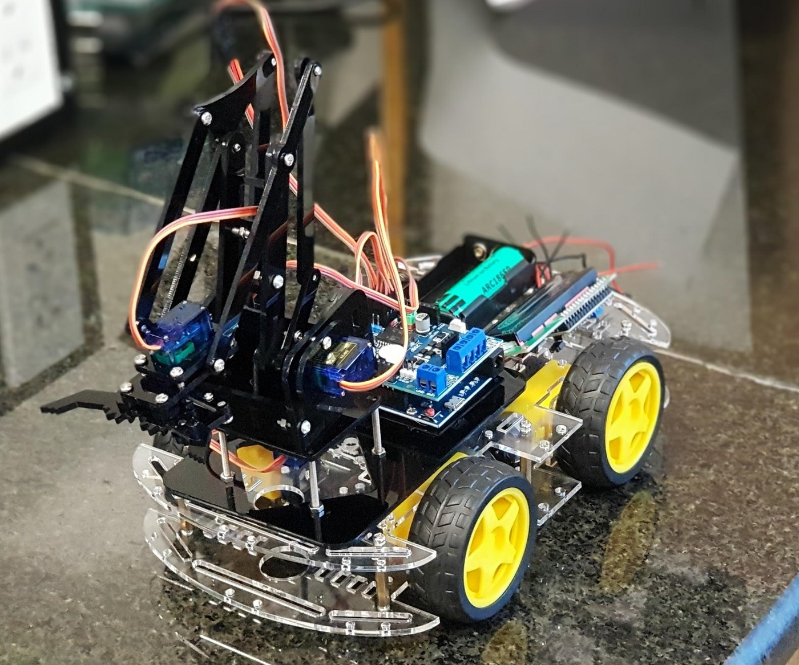
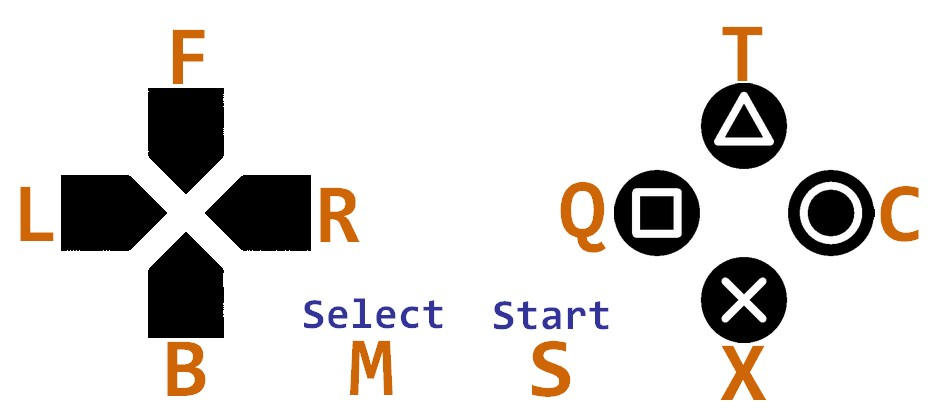
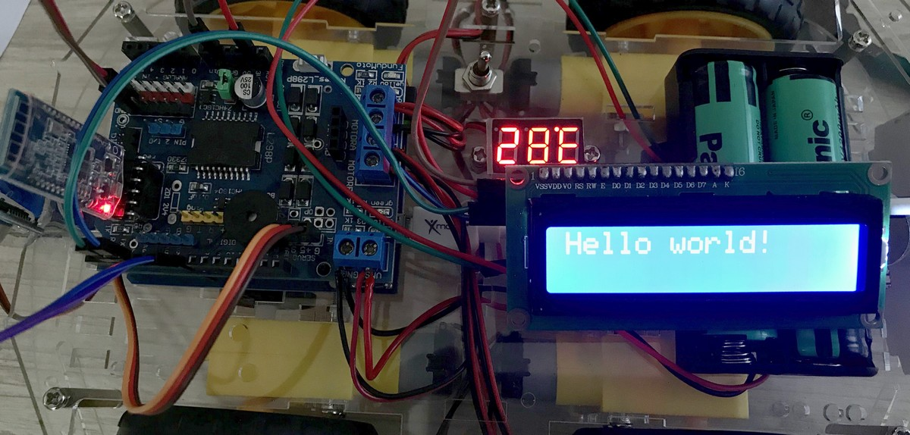
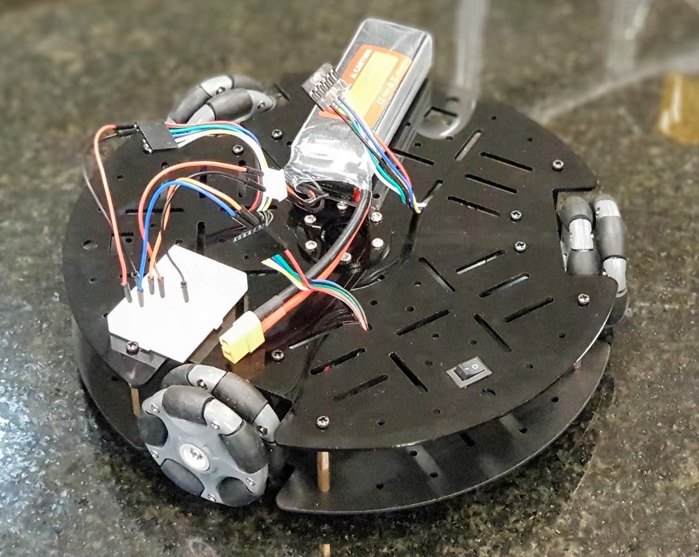
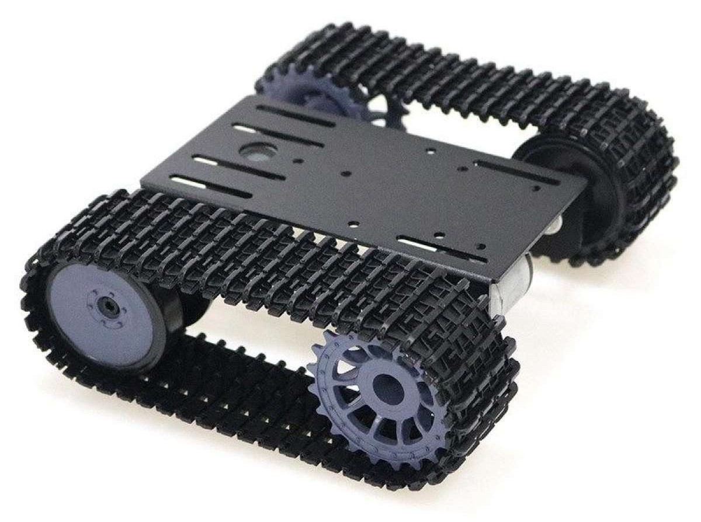
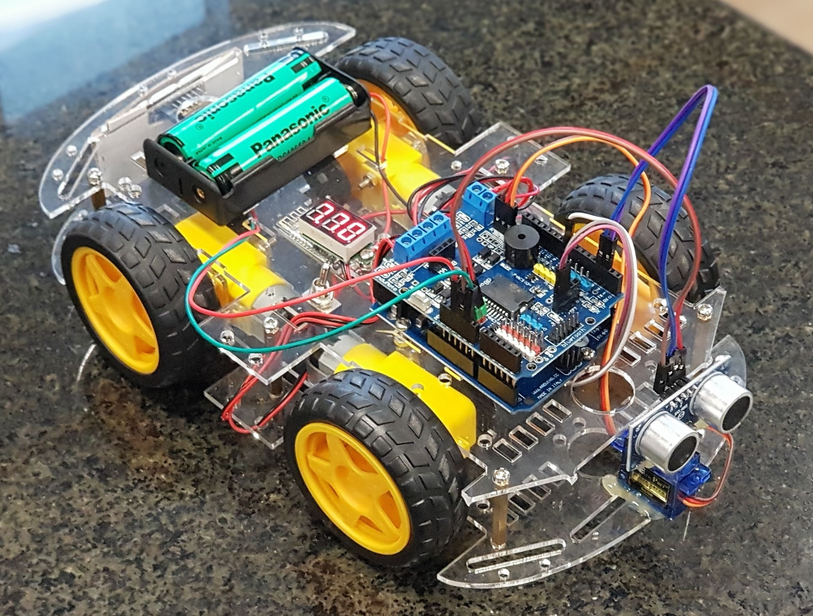
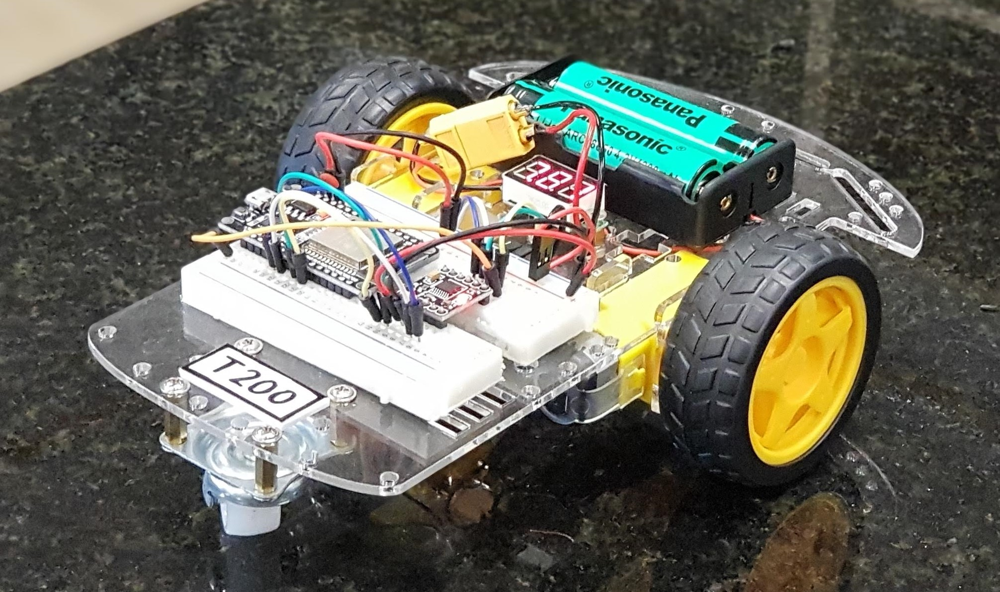
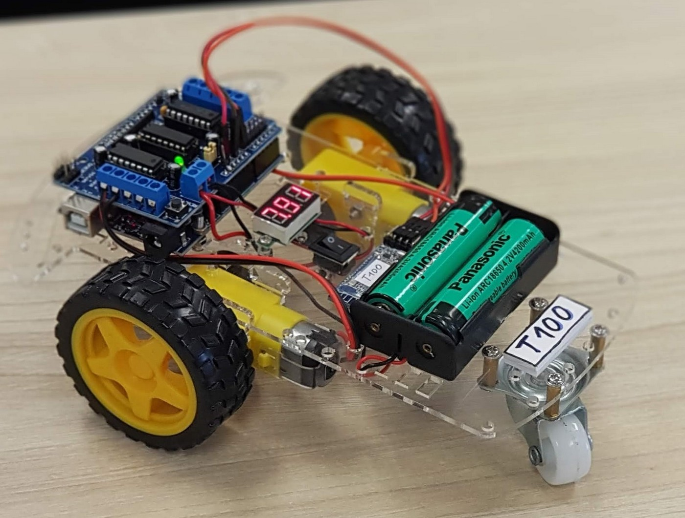

# T300 robot 3.0 at AISVN

This is the third iteration of our robots at AISVN as described in [the history](#history) further down. It used the Arduino Leonardo and incorporates:

This is our third iteration of student created robots. It includes:

- Motorshield L298 with buzzer on pin4
- 4 DoF robot arm with 4 servos on pin A0 to A3
- Bluetooth Low Energy connection with pin 0 and 1 (Serial1)
- PWM motor control on pin 10 to 13
- 1602 LCD display over I2C on pin 2 and 3 SDA SCL
- MPU6050 gyroscope for location control on I2C
- Ultrasonic distance with pin 7 (trigger) and pin 8 (echo/response)
- PS2X controller at pin 5 SC, 6 CLK, A4 DAT and A5 CMD

## Materials

We ordered the following materials for all students among others at [CỬA HÀNG IC ĐÂY RỒI](https://icdayroi.com/). This gives a common ground for further experiments both in software and hardware:

<table>
<thead><tr><th>nr</th>
<th>name</th>
<th>amount</th>
<th>unit price</th>
<th>price</th>
<th>link</th>
</tr></thead>
<tbody><tr>
<td align="right">1</td>
<td>Arduino Leonardo</td>
<td align="center">1</td>
<td align="right">125.000 VND</td>
<td align="right">125.000 VND</td>
<td><a href="https://icdayroi.com/arduino-leonardo-r3">link icdayroi.com</a></td>
</tr>
<tr>
<td align="right">2</td>
<td>Robot base 4 wheels</td>
<td align="center">1</td>
<td align="right">140.000 VND</td>
<td align="right">140.000 VND</td>
<td><a href="https://icdayroi.com/khung-xe-robot-4-banh">link icdayroi.com</a></td>
</tr>
<tr>
<td align="right">3</td>
<td>Motor Shield L298</td>
<td align="center">1</td>
<td align="right">120.000 VND</td>
<td align="right">120.000 VND</td>
<td><a href="https://icdayroi.com/arduino-motor-shield-l298">link icdayroi.com</a></td>
</tr>
<tr>
<td align="right">4</td>
<td>Bluetooth AT-09</td>
<td align="center">1</td>
<td align="right">75.000 VND</td>
<td align="right">75.000 VND</td>
<td><a href="https://icdayroi.com/mach-thu-phat-bluetooth-4-0-uart-cc2541-at-09">link icdayroi.com</a></td>
</tr>
<tr>
<td align="right">5</td>
<td>Battery 18650 3.7V</td>
<td align="center">2</td>
<td align="right">35.000 VND</td>
<td align="right">70.000 VND</td>
<td><a href="https://icdayroi.com/pin-cell-18650-4200mah-3-7v">link icdayroi.com</a></td>
</tr>
<tr>
<td align="right">6</td>
<td>Battery holder 2C 18650</td>
<td align="center">1</td>
<td align="right">7.000 VND</td>
<td align="right">7.000 VND</td>
<td><a href="https://icdayroi.com/hop-de-pin-18650-loai-2-cell">link icdayroi.com</a></td>
</tr>
<tr>
<td align="right">7</td>
<td>Power switch MTS 102</td>
<td align="center">1</td>
<td align="right">4.000 VND</td>
<td align="right">4.000 VND</td>
<td><a href="https://icdayroi.com/cong-tac-mts-102">link icdayroi.com</a></td>
</tr>
<tr>
<td align="right">8</td>
<td>Battery voltage display</td>
<td align="center">1</td>
<td align="right">22.000 VND</td>
<td align="right">22.000 VND</td>
<td><a href="https://icdayroi.com/dong-ho-do-von-volt-3-5-30v">link icdayroi.com</a></td>
</tr>
<tr>
<td align="right">9</td>
<td>Servo SG90</td>
<td align="center">5</td>
<td align="right">29.000 VND</td>
<td align="right">145.000 VND</td>
<td><a href="https://icdayroi.com/servo-sg90">link icdayroi.com</a></td>
</tr>
<tr>
<td align="right">10</td>
<td>Ultrasonic module HC-SR04</td>
<td align="center">1</td>
<td align="right">20.000 VND</td>
<td align="right">20.000 VND</td>
<td><a href="https://icdayroi.com/cam-bien-sieu-am-hc-sr04">link icdayroi.com</a></td>
</tr>
<tr>
<td align="right">11</td>
<td>Robot 4DOF kit</td>
<td align="center">1</td>
<td align="right">246.000 VND</td>
<td align="right">246.000 VND</td>
<td><a href="https://www.lazada.vn/products/4-dof-acrylic-chua-lap-rap-diy-canh-tay-robot-diy-bo-cho-arduino-may-lam-ho-tro-hoc-tap-sg90-servo-i267650656-s391094259.html?spm=a2o4n.searchlist.list.3.1b121f13xg7z7G&amp;search=1">link lazada.vn</a></td>
</tr>
<tr>
<td align="right">12</td>
<td>Wires DuPont MF and FF</td>
<td align="center">20</td>
<td align="right">300 VND</td>
<td align="right">6.000 VND</td>
<td><a href="https://thegioiic.com/products/day-be-cai-cai-dai-15cm">link thegioiic.com</a></td>
</tr>
<tr>
<td align="right">13</td>
<td>Voltmeter for Battery</td>
<td align="center">1</td>
<td align="right">21.000 VND</td>
<td align="right">21.000 VND</td>
<td><a href="https://thegioiic.com/products/dong-ho-do-ap-dc-2-5-30vdc">link thegioiic.com</a></td>
</tr>
<tr>
<td align="right">14</td>
<td>Display 1602 3.3V white on blue</td>
<td align="center">1</td>
<td align="right">32.000 VND</td>
<td align="right">32.000 VND</td>
<td><a href="https://thegioiic.com/products/lcd-1602-nen-xanh-duong-chu-trang-3-3v">link thegioiic.com</a></td>
</tr>
<tr>
<td align="right">15</td>
<td>I2C serial to parallel adapter</td>
<td align="center">1</td>
<td align="right">13.500 VND</td>
<td align="right">13.500 VND</td>
<td><a href="https://thegioiic.com/products/mach-giao-tiep-lcd-ky-tu-sang-i2c">link thegioiic.com</a></td>
</tr>
<tr>
<td align="right"></td>
<td> </td>
<td align="center"></td>
<td> </td>
<td align="right">1.046.500 VND</td>
<td> </td>
</tr>
</tbody></table>

Apart from these materials for 1.046.500 VND or 45 USD we need some time to assemble all parts - and then to program the robot car! Over the months of development several changes and standardizations took place. We ended up with a standard as platform at AISVN, to be found in the [respective github project](https://github.com/kreier/aisvn).

## Building steps

* Assemble the robot
* Connect the motors to M1 and M4 on the L293D shield
* Connect the bluetooth module pin TXD to pin 8 of the motorshield

## Remote

how to control with 10 keys

|   Key  | Character |  Mode 1  |  Mode 2  |    Mode 3    |      Mode 4      |
|:------:|:---------:|:--------:|:--------:|:------------:|:----------------:|
|    ↑   |     F     |  forward |  forward |              |                  |
|    ↓   |     B     | backward | backward |              |                  |
|    ←   |     L     |   left   |   left   |     left     |                  |
|    →   |     R     |   right  |   right  |     right    |                  |
| Select |     M     |   Menu+  |   Menu+  |     Menu+    |       Menu+      |
|  Start |     S     |   Start  |  Return  | toggle sound | start autonomous |
|    △   |     T     |   turbo  |    up    |              |                  |
|    ○   |     C     |  faster  |   open   |              |                  |
|    X   |     X     |   Stop   |   down   |              |       Stop       |
|    ☐   |     Q     |  slower  |   close  |              |                  |

- 'F' forward
- 'B' backward
- 'L' turn left
- 'R' turn right
- 'M' select (menu)
- 'S' start
- 'T' triangle
- 'C' circle
- 'X' button X
- 'Q' sQuare

## Pin assignment

| pin | general |      used for      |         note         |
|:---:|:-------:|:------------------:|:--------------------:|
| 0   |    RX   |    Bluetooth RX    |                      |
| 1   |    TX   |    Bluetooth TX    | has voltage divider 1kΩ/2kΩ for 3.3V |
| 2   |   SDA   |         I2C        |   Display 1602 and   |
| 3~  |   SCL   |         I2C        |  MPU 6050 gyroscope  |
| 4   |         |       buzzer       |   acoustic feedback  |
| 5~  |         |      PS2X CS       | Chip Select (SPI SS) |
| 6~  |         |      PS2X CLK      | Clock     (SPI SCLK) |
| 7   |         | Ultrasonic trigger |                      |
| 8   |         |   Ultrasonic echo  |                      |
| 9~  |         |  Servo ultrasonic  |                      |
| 10~ |         |         E1         | enable Moter 1 (PWM) |
| 11~ |         |         E2         | enable Motor 2 (PWM) |
| 12  |         |         M1         |   forward/backward   |
| 13  |   LED   |         M2         |   forward/backward   |
| A0  |         | Servo left-right   | Robotarm 5-175       |
| A1  |         | Servo up-down      | Robotarm 45-120      |
| A2  |         | Servo forward-back | Robotarm 65-140      |
| A3  |         | Servo open-close   | Robotarm 90-125      |
| A4  |         |      PS2X DAT      | Data    (SPI MISO)   |
| A5  |         |      PS2X CMD      | Command (SPI MOSI)   |

### Issues

After some time of use almost all of the boards no longer support PWM for pin 11 on the motor shield. Any value below 255 is interpreted as a low and the motor is shut off. Not very usefull for a motor project. Same is true for pin 1. Even though a voltage divider with 1kΩ/2kΩ is reducing the output voltage of the Arduino to 3.3 V several boards don't submit any signal. The bluetooth module can therefore only receive information, but not send them back.

### 1602 display over I2C

For optic feedback on the selected mode and current status we added a display with 16 characters in 2 rows. Instead of using 8 digital lines from the Arduino we utilized the I2C bus and needed only 2 wires - and potential 225 further I2C devices to connect. On November 24th, 2019 we got the successful feedback:

## History

- 2019-12-17 [T300](https://kreier.github.io/T300) this robot with 4 wheels, robot arm, ultrasonic distance sensor is the enhanced asa robot. Winner of the first AISVN robot competition [ROBOT 2019](https://sites.google.com/ais.edu.vn/robot2019).
- 2019-11-04 [asa](https://github.com/kreier/asa) robot from first ASA period 2019/2020, evolved to T300 in the second period. After 9 sessions 60% of the students successfully finished their remote controlled robot.
- 2019-04-08 [T200](https://github.com/kreier/T200) updated 2-wheel robot, controlled by an ESP32 over BLE and the software  reverse engineered for our purpose.
- 2019-03-26 [T80](https://github.com/kreier/T80) simplified version for Viet for the [Sciencefair 2019](https://sites.google.com/ais.edu.vn/sciencefair2019/grade-9) Design project. Has a L298N motor driver and HC-05 bluetooth module. Power supply was upgraded to LiIon because the 4 AA batteries provided not enough voltage for the bluetooth module once the motors where started. 
- 2018-10-25 [T110](https://github.com/kreier/T110) updated robot with Bluetooth 4.0 remote to be used by iOS devices.
- 2018-10-09 [T100](https://github.com/kreier/T100) first robot with Bluetooth remote control, 2 wheels, L293D motorshield.

### Gallery

      

## Materials 2019 - has been updated

We ordered the following materials at [CỬA HÀNG IC ĐÂY RỒI](https://icdayroi.com/) for all students to have a common ground for further experiments both in software and hardware:

1. [Arduino Leonardo](https://icdayroi.com/arduino-leonardo-r3) (because of the Micro-USB interface) 125.000₫
2. [Khung xe robot 4 bánh](https://icdayroi.com/khung-xe-robot-4-banh) (4 wheels - stable driving) 140.000₫
3. [Arduino Motor Shield L298](https://icdayroi.com/arduino-motor-shield-l298) 120.000₫
4. [Module thu phát bluetooth HC-05](https://icdayroi.com/module-thu-phat-bluetooth-hc-05) 80.000₫
5. [Pin Cell 18650 4200mAh 3.7V](https://icdayroi.com/pin-cell-18650-4200mah-3-7v) (4 AA batteries are not enough for motor and bluetooth, and not rechargable) 35.000₫
6. [Hộp đế pin 18650 loại 2 cell](https://icdayroi.com/hop-de-pin-18650-loai-2-cell) battery holder for two 18650 batteries 7.000₫
7. [Công tắc gạt MTS-103 3 trạng thái](https://icdayroi.com/cong-tac-gat-mts-103-3-trang-thai) power switch for the robot 5.500₫
8. [Đồng hồ đo Vôn (Volt) 3.5-30V](https://icdayroi.com/dong-ho-do-von-volt-3-5-30v) Voltage display to check the charge level of the battery 22.000₫
9. Four 10 cm cable 0.25 mm² to connect the motors to the shield ₫
10. Three female-male jumper wire to connect the bluetooth module to the Arduino (+3.3V, GND, RX)
11. So in general: some [jumper wires](https://icdayroi.com/bo-day-cam-test-board-65-soi) 19.000₫
12. Maybe [a breadboard](https://icdayroi.com/testboard-mini-syb-170) to connect 5.000₫

All in all some 550.000₫ are already spend on these simple materials. Further steps include the collaborative project of a self driving robot ([Khung xe robot omni đa hướng](https://icdayroi.com/khung-xe-robot-omni-da-huong) 2.250.000₫), controlled by an [Raspberry Pi](https://thegioiic.com/products/raspberry-pi-4-model-b-2gb) 1.580.000 VND with [Camera](https://thegioiic.com/products/camera-8mp-imx219-160-degree-fov) 305.000 VND for object detection and obstacle avoidance.

### Future updates

The above program consumes 91% of the available RAM of the Arduino Leonardo. For future projects we need more. Some contenstants:

|        Model       | RAM instructions |  RAM data |         Flash |    Clock | Pins |
|:------------------:|-----------------:|:---------:|--------------:|---------:|:----:|
| Arduino Leonardo   |           2.5 KB |     -     |         32 KB |   16 MHz |  20  |
| ESP8266 (NodeMCU)  |            32 KB |   80 KB   |       4000 KB |  160 MHz |  12  |
| ESP32 (WROVER-32)  |           520 KB |  4000 KB  |       4000 KB |  240 MHz |  20  |
| Raspberry Pi 1     |       512,000 KB |     -     | 16,000,000 KB |  700 MHz |  26  |
| Raspberry Pi 4     |     4,000,000 KB |     -     | 64,000,000 KB | 1500 MHz |  40  |
| Nvidia Jetson Nano |     4,000,000 KB | 473 GFLOP | 16,000,000 KB | 918 MHz  |  40  |

## Remote

how to control with 10 keys

- 'F' forward
- 'B' backward
- 'L' turn left
- 'R' turn right
- 'M' select (menu)
- 'S' start
- 'T' triangle
- 'C' circle
- 'X' button X
- 'Q' sQuare

## Pin assignment

| pin | general |      used for      |          note         |
|:---:|:-------:|:------------------:|:---------------------:|
| 0   |    RX   |    Bluetooth RX    |                       |
| 1   |    TX   |    Bluetooth TX    |   5V level, not 3.3!  |
| 2   |         | Ultrasonic trigger |                       |
| 3~  |         |   Ultrasonic echo  |                       |
| 4   |         |       buzzer       |   acoustic feedback   |
| 5~  |         |                    |                       |
| 6~  |         |                    |                       |
| 7   |         |                    |                       |
| 8   |         |                    |                       |
| 9~  |         |  Servo ultrasonic  |                       |
| 10~ |         |         E1         |  enable Moter 1 (PWM) |
| 11~ |         |         E2         |  enable Motor 2 (PWM) |
| 12  |         |         M1         |    forward/backward   |
| 13  |   LED   |         M2         |    forward/backward   |
| A0  |         | Servo left-right   | Robotarm 5-175        |
| A1  |         | Servo up-down      | Robotarm 45-120       |
| A2  |         | Servo forward-back | Robotarm 65-140       |
| A3  |         | Servo open-close   | Robotarm 90-125       |
| A4  |         |                    |                       |
| A5  |         |                    |                       |
| SDA | I2C     | Display 1602       | optic feedback        |
| SCL | I2C     | MPU6050            | gyroscope orientation |

## Remote control software

- iOS: BitBlue
- Android and PC: Chrome and this browser page: (https://kreier.github.io/remote) 

## Menu (select, confirmed by number of beeps from buzzer)

1. General driving
2. Ultrasonic distance with acoustic feedback
3. Autonomuous driving (start triangle, stop x)
4. Control robot arm

## History - gallery

### T500

2020-04-04

### T400

2020-02-02

### T300

2019-11-18

### asa

2019-11-04

### T200

2019-04-08

### T80

2019-03-26

### T110

2018-10-25

### T100

2018-10-09

