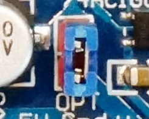

# Motorshield L298P

This useful shield has a motor driver L298P with inverter, so only 4 digital pins are needed to drive 2 motors with PWM. The Bluetooth port has a voltage divider for 3.3 Volt to protect the modules. Header for 7 Servo motors are presend, as well as an ultrasonic sensor. And the motor output is visualized with colored LEDs.

More can be found at https://protosupplies.com/product/l298p-motor-driver-shield/

## Voltage drop

My measurements show 

... follows ...

## Limitations

The PWM for the two motors is connected to pin 10 and 11. But the PWM driver for pin 10 uses the timer 1 of the Arduino. Once a servo is activated this timer can no longer be used for PWM and the funtionality on pin 10 is lost. I had to program a reset into the program, since a `detach()` for the servo library does not work.

## Description from protosupplies

The FunduMoto L298P Motor Driver Shield is a multi-featured motor shield based around the L298P driver chip and fits Arduino Uno or other Arduino with compatible I/O pins.

### PACKAGE INCLUDES:
- L298P Motor Driver Shield

### KEY FEATURES OF L298P MOTOR DRIVER SHIELD:
- Drive 2 DC motors at 4.8-24V at up to 2A peak (2.5A peak) current.
- Built-in Schottky diodes to protect against motor back EMF.
- Drive 1 servo motor with a dedicated 5V regulated power.
- Built-in buzzer.
- Remote reset switch.
- Bluetooth connector (x2).
- Ultrasonic Range Finder Ping connector.
- RGB LED connector
- 6 Analog/digital pins brought out to 3-pin headers with 5V and Gnd available for each input for easy sensor hookup.
- Stacking female connectors for supporting another daughter card.
- Can optionally power attached Arduino off the shield.

### Logic Power subsystem
The Arduino 5V is brought up to the shield and is available on the 6 sets of red sensor 5V pins, the yellow Ping connector for Ultrasonic Rangefinders and the 2 blue digital connectors. It is also used to power the logic portion of the L298P chip.  This ensures that they have good clean 5V power independent of what the motors are doing.

The Arduino 3.3V is brought up to the shield and is available on the 2 Bluetooth connectors.

The Arduino can be powered separately using the normal USB or DC power connector or it can also be powered from the Shield.   To select this, there is a jumper near the electrolytic cap labeled ‘OPT’.  When this jumper is removed, the Arduino must be powered separately.  When the jumper is installed, the power from the motor VMS power connector is connected to the Vin pin on the Arduino which feeds the Arduino on-board 5V regulator.  To use this option, the motor power input must be at least 6.5V to feed the regulator.  If powering the Arduino off the shield, the DC power jack on the Arduino should not be used to avoid a power conflict, but the USB can be used.

### Motor Power Subsystem
The motor power comes in on the 2-pos screw terminal.  The VMS is the positive motor voltage which can range from 4.8 to 24V.  If you are using this input to power the Arduino by installing the ‘OPT’ jumper, the maximum input voltage on this terminal should be limited to 12V to avoid overheating the Arduino regulator.

     1 x 2 Screw Terminal (Motor Power)

- VMS = Motor Vcc which must be between 4.8 and 24V.
- GND = Motor Ground

This motor power is fed to a 5V regulator that is mounted to the bottom of the shield.  This 5V feeds the white servo connector.  This isolates any servo electrical noise from getting back into the main 5V that powers the logic. For this 5V regulator to function, the VMS voltage must be at least 6.3V.

Note that if you have the OPT jumper in place and USB connected, but there is no power on the VMS motor connector, it will try to use the USB power to power the DC motors.  This should be avoided.

If you have the OPT jumper in place and power coming on the DC Jack on the Arduino, it will work but the DC motor noise will be coupled into the 5V logic power supply and may cause eradicate behavior and so it is not really recommended.  In general, if you are using the motors, you should plan to bring the motor power in on the VMS power connector for the most stable operation.

### Driving DC Motors
The L298P contains two full H-Bridge drive channels that provide full speed and direction control.  The 2 DC motor drive channels can operate at voltages from 4.8 – 24V and at currents of up to 2.0A (2.5A peak) per channel.

You can also have 2 motors share a motor drive channel as long as the combined current stays within the 2A and you don’t mind the motors turning the same direction and speed.  This is typically the case when you have a 4 wheel drive robotic vehicle and the 2 wheels on each side operate at the same speed and direction.

The L298P motor driver uses Arduino pins D10, D11, D12 and D13 for motor control.  Pins 10 & 11 are PWM pins and connect to the chip EN pins to provide speed control by modulating the enable input.  D10 controls speed of motor A and D11 controls speed of motor B.

Pins 12 & 13 are connected to the IN inputs to provide direction control.  Pin 12 controls direction of motor A and Pin 13 controls direction of motor B.  Usually there are 2 pins used to determine the direction of rotation for each motor, but this shield has an inverter that provides an inverted version of the signal to the two pins.  This reduces the number of pins used on the Arduino, but it does remove the ability to do dynamic braking which usually isn’t an issue for most projects.  Reducing the speed control pins to a PWM value of zero will get things stopped.

Speed Pins	Speed Control	Direction Pins	Direction Control
Motor A	D10	PWM 0-100	D12	HIGH = Forward	LOW = Reverse
Motor B	D11	PWM 0-100	D13	HIGH = Forward	LOW = Reverse
DC Motor Connections
The motor connections are via a 4 screw terminal block with 2 terminals for each motor that are labeled MOTORA and MOTORB.

The +/- pins for each motor are not labeled, so it is somewhat arbitrary how your wire them and relative to what you consider forward vs reverse motor operation.  Basically if the motor goes in the opposite direction than you expect, simply reverse the wiring for that motor.

     1 x 4 Screw Terminal (Motor Control)L298P Motor Driver Shield - Motor Connections

Motor A Positive Lead
Motor A Negative Lead
Motor B Positive Lead
Motor B Negative Lead
These motor connection points are also mirrored on a 4-pin female header for a little more flexibility.

These motor drive leads also have yellow and green LEDs attached to them.  Their brightness will vary depending on the strength of the PWM signal

1 x 4 Female Header (Black)

MA = Motor A connection (x2)
MB = Motor B connection (x2)
 Servo Motor Connections
Servo motors are 3 wire devices.  They require 5V, Ground and a PWM signal to set its position.  The shield uses D9 for the PWM signal.  One nice feature of these modules is that it has a dedicated 5V regulator to power the servo to prevent electrical noise from getting back into the main 5V logic power.

Servos are typically used to turn a small steering wheel or to rotate a sensor, such as an ultrasonic rangefinder for obstacle avoidance.

To use the servo, you will need to have a minimum of 6.3V on the main motor power connector for the regulator to operate.

If you are not using a servo, D9  as well as this dedicated 5V is available for other uses.

       1 x 3 Servo Header (White)L298P Motor Driver Shield - Servo Output

   G = Ground
+5V = Dedicated 5V for powering servo motor
   9 = D9 is the PWM pin that the servo is driven off of.  This pin is available for other use if not using it to drive a servo motor.
Arduino to Shield Pin Connections
All of the I/O is brought up to stackable female headers on the shield except for the IOREF and the two I2C pins hear the USB connector so it can support a daughter shield as long as it does not conflict with the pins in use.  In addition, many of these pins are broken out to other headers for easy hookup.

The shield uses the following pins which remain available if you are not using that function:

Ultrasonic Sensor Ping Control = D7, D8
Servo motor control = D9
DC motor control =  D10,D11, D12, D13
Buzzer = D4
Bluetooth
There are two Bluetooth connectors on the board

The first connector is a 4-pin header that brings out 3.3V power, ground, TX and RX.  This type of connector is compatible with HC-06 Bluetooth modules and perhaps some others.  The Receive pin has a 1K/2K voltage divider to level shift the TX output of the Arduino to be 3.3V compatible which is a nice feature.

     1 x 4 Bluetooth ‘BT2’ Female Header (Black)L298P Motor Driver Shield - Bluetooth Headers

‘+‘ =  3.3V
‘–‘ = Ground
T = D0 (RX)
R = D1 (TX)
The other Bluetooth header is a 12-pin male header.  The TX, RX  5V and ground are hooked up to this header.  The only 12-pin Bluetooth connectors are generally associated with automobiles, so this connector does not seem to be of much use.  The pin spacing is also 2mm rather than the standard 2.54mm

Ultrasonic Rangefinder
A common robotic interface is Ultrasonic Rangefinders such as the HY-SRF05.  These work by sending out a ping of ultrasonic sound and timing how long it takes for the ping to come back.  The board has a dedicated 4-pin header to connect the sensor.

     1 x 4 Ping Male Header (Yellow)L298P Motor Driver Shield - Ping Sensor Header

+ = 5V
R = Return (D8)
T = Trigger (D7)
G = Ground
Analog / Digital Sensors
A common issue when hooking sensors up to an Ardino is that many require ground/Vcc connections as well as an analog input or digital I/O.  This board brings out the A0-A5 pins to a row of headers that also provide separate power and ground points for each A0-A5 pin .  The white headers are the signal lines, the red headers provide 5V and the black headers provide ground.

The The  A0-A5 pins can be used either for analog inputs or as digital I/O, so both types of sensors can be supported.

     3 x 6 Header (White/Red/Black)L298P Motor Driver Shield - Analog & Digital Sensor Inputs

A0 / 5V / Ground
A1 / 5V / Ground
A2 / 5V / Ground
A3 / 5V / Ground
A4 / 5V / Ground
A5 / 5V / Ground
There is also a 3-pin blue header that that brings out 5V, ground and D2 that can be used for a digital sensor or other remote connection

      1 x 3 Header (Blue)L298P Motor Driver Shield - Digital Sensor Input

G = Ground
‘+‘ = 5V
S = D2 – digital I/O
RGB LED
And for good measure, there is a 5-pin header that brings out D3, D5, D6, 5V and Ground.  This puts 3 PWM outputs along with power and ground on a single connector which can be handy for a number of things like driving an RGB LED.

      1 x 5 Header (Blue)L298P Motor Driver Shield - RGB LED Output Connector

‘ ‘ = 5V – This pin is unmarked but sits next to D7
B = D6 – B could be used for Blue on RGB LED
G = D5 – G could be used for Green on RGB LED
‘-‘ = Ground
R = D3 – R could be used for Red on RGB LED
Buzzer
The buzzer is wired to D4.  It is active HIGH

Reset Switch
The shield has a remote reset button located on it for easy access.

OUR EVALUATION RESULTS:
These shields are quite flexible and a significant step-up in versatility from the older L293 based modules, albeit at a higher price.  The weakest point is the L298P motor driver IC which limits the size of motors that it can control, but if your requirements fall within its 2A per channel rating as most smaller robotic vehicles do, this can be a nice option for putting together a robotic project.

The header pins are quite long and flexible.  You will need to coax them into alignment as you insert the shield into the Arduino board.  Also note that the shield can sit down on the top of the USB connector of some boards.  To avoid any shorting concern, a little electrical or kapton tape can be used to insulate the top of the connector.

The program below runs the DC motor control portion through an automated sequence of events.

Be sure to connect a valid motor voltage to the motor VMS screw terminal and connect one or more smaller motors to the MotorA / MotorB screw terminals
